<div align="center">

# 🔬 ShodhAI

### *Autonomous AI Research Report Generation Platform*

[](https://python.org)
[](https://fastapi.tiangolo.com)
[](https://langchain-ai.github.io/langgraph/)
[](https://docker.com)
[](https://azure.microsoft.com)
[](LICENSE)

**ShodhAI** (शोध = *Research* in Hindi) is a full-stack AI platform that autonomously generates comprehensive, publication-ready research reports on any topic — powered by multi-agent orchestration, real-time web research, and human-in-the-loop refinement.

[Features](#-key-features) · [HLD](#-high-level-design-hld) · [LLD](#-low-level-design-lld) · [System Design](#-system-design) · [Setup](#-getting-started) · [Deployment](#-deployment)

</div>

---

## 🎯 The Problem

Researching a topic deeply takes hours — reading multiple sources, cross-referencing information, synthesizing insights, and structuring everything into a coherent report. Traditional tools just assist with search; they don't actually *think*, *analyze*, or *write* for you.

## 💡 The Solution

**ShodhAI** automates the entire research lifecycle. It doesn't just search — it deploys a team of AI analyst personas that each approach the topic from a different angle, conduct structured interviews backed by real-time web data, and collaboratively produce a multi-section research report with proper citations. The result is a downloadable, publication-ready document in DOCX or PDF format.

---

## ✨ Key Features

### 🤖 Multi-Agent Research Pipeline
- Dynamically generates **diverse AI analyst personas** (technical, ethical, business, policy, etc.) tailored to each topic
- Each analyst independently conducts a structured interview with an AI expert, asking probing questions from their unique perspective
- Parallel execution ensures comprehensive coverage of the topic

### 🌐 Real-Time Web Research
- Integrated with **Tavily Search API** for real-time web data retrieval
- AI agents autonomously formulate search queries based on interview context
- Sources are cited and traceable throughout the final report

### 🧠 LangGraph-Powered Orchestration
- Built on **LangGraph** — a stateful, graph-based AI workflow engine
- Complex DAG (Directed Acyclic Graph) with conditional edges, parallel branches, and interrupt points
- Full state persistence with checkpointing for resumable workflows

### 👤 Human-in-the-Loop Refinement
- After AI generates analyst personas, the user can provide **real-time feedback** to refine perspectives
- Interrupt-resume architecture allows the pipeline to pause, accept input, and continue seamlessly
- Iterative refinement until the user is satisfied with the research direction

### 📄 Multi-Format Export
- Reports automatically exported as both **DOCX** and **PDF**
- Structured with proper headings, sections, introduction, conclusion, and source citations
- Smart text wrapping, centered layout, and page management for PDF output

### 🔐 User Authentication System
- Secure **signup/login** with bcrypt password hashing
- Session-based authentication with cookie management
- SQLAlchemy ORM with SQLite for user data persistence

### 🎨 Clean Web Interface
- Responsive **FastAPI + Jinja2** web UI with glassmorphism-inspired design
- Real-time loading spinners during report generation
- Password visibility toggle, form validation, and download buttons
- Gradient backgrounds with smooth fade-in animations

### 📊 Structured Logging & Error Handling
- **Structlog** JSON-based structured logging (console + file)
- Custom exception hierarchy with full traceback capture
- Timestamped log files for audit trails

### 🐳 Production-Ready Infrastructure
- Multi-stage **Dockerfile** for optimized container images
- **Jenkinsfile** CI/CD pipeline for automated testing and deployment
- **Azure Container Apps** deployment with secrets management
- Health check endpoint for container orchestration

---

## 🏛️ High-Level Design (HLD)

The platform follows a **layered architecture** with clear separation between the Presentation, Application, AI Orchestration, and Infrastructure layers.


### HLD — Component Interaction Overview

```mermaid
flowchart LR
    User([👤 User]) -->|"1. Enter Topic"| Dashboard["📊 Dashboard"]
    Dashboard -->|"POST /generate_report"| FastAPI["⚡ FastAPI"]
    FastAPI -->|"2. Invoke"| ReportService["🔧 Report Service"]
    ReportService -->|"3. Start Pipeline"| LangGraph["🧠 LangGraph<br/>Workflow Engine"]
    LangGraph -->|"4. Generate"| Analysts["🤖 AI Analysts"]
    LangGraph -.->|"5. Interrupt"| Feedback["👤 Human Feedback"]
    Feedback -.->|"6. Resume"| LangGraph
    LangGraph -->|"7. Fan-out"| Interviews["🎙️ Parallel<br/>Interviews"]
    Interviews -->|"8. Search"| Tavily["🌐 Tavily API"]
    Interviews -->|"8. Reason"| LLM["🤖 LLM Provider"]
    LangGraph -->|"9. Compile"| Report["📄 Report<br/>Assembly"]
    Report -->|"10. Export"| Files["📁 DOCX + PDF"]
    Files -->|"11. Download"| User
```



---

## 🔧 Low-Level Design (LLD)

### LLD 1 — Main Report Generation Graph (LangGraph DAG)

This is the core state machine that orchestrates the entire report pipeline. Each node is a function that reads/writes to a shared `ResearchGraphState`.

```mermaid
stateDiagram-v2
    [*] --> CreateAnalysts: START

    CreateAnalysts --> HumanFeedback: analysts generated

    HumanFeedback --> ConductInterview1: feedback received ✅
    HumanFeedback --> ConductInterview2: (parallel fan-out via Send API)
    HumanFeedback --> ConductInterview3: one interview per analyst
    HumanFeedback --> [*]: no analysts / END

    state "Interview Sub-Graph" as ConductInterview1
    state "Interview Sub-Graph" as ConductInterview2
    state "Interview Sub-Graph" as ConductInterview3

    ConductInterview1 --> WriteReport: sections[]
    ConductInterview2 --> WriteIntroduction: sections[]
    ConductInterview3 --> WriteConclusion: sections[]

    WriteReport --> FinalizeReport
    WriteIntroduction --> FinalizeReport
    WriteConclusion --> FinalizeReport

    FinalizeReport --> [*]: final_report assembled

    note right of HumanFeedback
        💡 interrupt_before
        Pipeline pauses here for
        human analyst feedback
    end note

    note right of FinalizeReport
        📄 Joins introduction +
        content + conclusion +
        sources into final string
    end note
```



### LLD 2 — Interview Sub-Graph (Per Analyst)

Each analyst runs through this independent sub-graph. The `max_num_turns` parameter controls interview depth.


### LLD 3 — State Models (Pydantic + TypedDict)


### LLD 4 — API Route Design

```mermaid
sequenceDiagram
    actor User
    participant UI as Web UI
    participant API as FastAPI Router
    participant Auth as Auth Service
    participant DB as SQLite DB
    participant RS as Report Service
    participant LG as LangGraph
    participant LLM as LLM Provider
    participant TV as Tavily Search

    User->>UI: GET / (Login Page)
    UI-->>User: login.html

    User->>API: POST /login (username, password)
    API->>Auth: verify_password()
    Auth->>DB: query User
    DB-->>Auth: user record
    Auth-->>API: session_id cookie
    API-->>User: 302 → /dashboard

    User->>API: POST /generate_report (topic)
    API->>RS: start_report_generation(topic, 3)
    RS->>LG: graph.stream(topic, max_analysts)
    LG->>LLM: create analyst personas
    LLM-->>LG: List[Analyst]
    LG-->>RS: thread_id (paused at human_feedback)
    RS-->>API: thread_id
    API-->>User: report_progress.html

    User->>API: POST /submit_feedback (feedback, thread_id)
    API->>RS: submit_feedback(thread_id, feedback)
    RS->>LG: update_state → resume pipeline

    loop For Each Analyst (Parallel)
        LG->>LLM: generate interview question
        LG->>TV: web search
        TV-->>LG: search results
        LG->>LLM: generate expert answer
        LG->>LLM: write report section
    end

    LG->>LLM: write introduction + conclusion (parallel)
    LG->>LG: finalize_report()
    RS->>RS: save_report(DOCX + PDF)
    RS-->>API: doc_path, pdf_path
    API-->>User: download links

    User->>API: GET /download/report.pdf
    API-->>User: 📄 FileResponse
```



---

## 🏗️ System Design

### System Context Diagram


### Request Flow — Complete Data Pipeline

```mermaid
flowchart TD
    A["👤 User submits topic<br/>'Impact of AI on Healthcare'"] --> B["⚡ FastAPI receives<br/>POST /generate_report"]
    B --> C["🔧 ReportService<br/>creates thread_id"]
    C --> D{"🧠 LangGraph<br/>Pipeline Start"}

    D --> E["🤖 CreateAnalysts Node<br/>LLM generates N personas"]
    E --> F["⏸️ HumanFeedback Node<br/>(interrupt_before)"]

    F -->|"User provides feedback"| G{"Feedback<br/>Empty?"}
    G -->|"No — refine"| E
    G -->|"Yes — proceed"| H["📡 Fan-Out via Send() API"]

    H --> I1["🎙️ Analyst #1<br/>Interview Sub-Graph"]
    H --> I2["🎙️ Analyst #2<br/>Interview Sub-Graph"]
    H --> I3["🎙️ Analyst #3<br/>Interview Sub-Graph"]

    I1 --> J["📝 Sections Collected<br/>(Annotated list with operator.add)"]
    I2 --> J
    I3 --> J

    J --> K1["✍️ Write Report<br/>(consolidate sections)"]
    J --> K2["✍️ Write Introduction"]
    J --> K3["✍️ Write Conclusion"]

    K1 --> L["🔗 Finalize Report<br/>intro + content + conclusion + sources"]
    K2 --> L
    K3 --> L

    L --> M["💾 Save Report<br/>DOCX + PDF export"]
    M --> N["📥 User Downloads<br/>GET /download/filename"]

    style A fill:#3b82f6,stroke:#2563eb,color:#fff
    style F fill:#f59e0b,stroke:#d97706,color:#fff
    style H fill:#8b5cf6,stroke:#7c3aed,color:#fff
    style L fill:#10b981,stroke:#059669,color:#fff
    style N fill:#ec4899,stroke:#db2777,color:#fff
```



### CI/CD Pipeline Architecture

```mermaid
flowchart LR
    subgraph DEV["👨‍💻 Development"]
        Code["Source Code<br/>(GitHub)"]
    end

    subgraph CI["🔄 Continuous Integration"]
        Checkout["📥 Checkout"]
        Setup["🐍 Python Setup"]
        Install["📦 Install Deps"]
        Test["✅ Run Tests"]
    end

    subgraph CD["🚀 Continuous Deployment"]
        Build["🐳 Docker Build<br/>(Multi-stage)"]
        Push["📤 Push to ACR<br/>(Azure Container Registry)"]
        Deploy["☁️ Deploy to<br/>Azure Container Apps"]
        Verify["✔️ Health Check<br/>/health endpoint"]
    end

    subgraph PROD["🌍 Production"]
        App["🔬 ShodhAI App<br/>(Container Instance)"]
        Secrets["🔐 Azure Secrets<br/>(API Keys)"]
    end

    Code --> Checkout --> Setup --> Install --> Test
    Test --> Build --> Push --> Deploy --> Verify
    Deploy --> App
    Secrets --> App

    style DEV fill:#1e293b,stroke:#334155,color:#e2e8f0
    style CI fill:#1e3a5f,stroke:#2563eb,color:#e2e8f0
    style CD fill:#14532d,stroke:#16a34a,color:#e2e8f0
    style PROD fill:#7c2d12,stroke:#ea580c,color:#e2e8f0
```



### Deployment Architecture

```mermaid
graph TB
    subgraph AZURE["☁️ Azure Cloud"]
        subgraph RG["Resource Group: shodhai-app-rg"]
            subgraph ACR["Azure Container Registry"]
                IMG["shodhai-app:latest"]
            end

            subgraph ENV["Container Apps Environment"]
                APP["🔬 ShodhAI Container<br/>Port 8000<br/>1 CPU · 2GB RAM<br/>Min: 1 · Max: 3 replicas"]
            end

            subgraph SECRETS["Container Secrets"]
                S1["OPENAI_API_KEY"]
                S2["GOOGLE_API_KEY"]
                S3["GROQ_API_KEY"]
                S4["TAVILY_API_KEY"]
            end
        end

        subgraph JENKINS_RG["Resource Group: shodhai-jenkins-rg"]
            JENKINS["🔧 Jenkins Container<br/>Port 8080<br/>2 CPU · 4GB RAM"]
            STORAGE["📁 Azure File Share<br/>(Jenkins persistent data)"]
        end
    end

    INTERNET(("🌐 Internet")) <-->|"HTTPS"| APP
    JENKINS -->|"Build & Deploy"| ACR
    ACR -->|"Pull Image"| APP
    SECRETS -->|"Inject"| APP
    STORAGE -->|"Mount"| JENKINS

    style AZURE fill:#0f172a,stroke:#1e40af,color:#e2e8f0
    style RG fill:#1e293b,stroke:#334155,color:#e2e8f0
    style JENKINS_RG fill:#1e293b,stroke:#334155,color:#e2e8f0
    style APP fill:#059669,stroke:#10b981,color:#fff
    style JENKINS fill:#2563eb,stroke:#3b82f6,color:#fff
```



---

## 🛠️ Tech Stack

| Layer | Technology | Purpose |
|-------|-----------|---------|
| **AI Orchestration** | LangGraph | Stateful multi-agent workflow with checkpointing |
| **LLM Providers** | OpenAI GPT-4o / Google Gemini / Groq | Flexible multi-provider LLM support |
| **Web Search** | Tavily API | Real-time web research with source attribution |
| **Backend** | FastAPI + Uvicorn | High-performance async API server |
| **Frontend** | Jinja2 + Vanilla CSS + JS | Server-rendered responsive web UI |
| **Database** | SQLAlchemy + SQLite | User authentication & session management |
| **Security** | bcrypt + Passlib | Password hashing & verification |
| **Document Export** | python-docx + ReportLab | DOCX and PDF report generation |
| **Logging** | Structlog | JSON-structured logging with file persistence |
| **Containerization** | Docker (multi-stage) | Optimized production container images |
| **CI/CD** | Jenkins | Automated build, test, and deployment pipeline |
| **Cloud** | Azure Container Apps | Scalable serverless container deployment |

---

## 🚀 Getting Started

### Prerequisites
- Python 3.11+
- API keys for at least one LLM provider
- Tavily API key for web search

### Installation

```bash
# Clone the repository
git clone https://github.com/jaiswal-naman/ShodhAI.git
cd ShodhAI

# Create and activate virtual environment
python -m venv venv
.\venv\Scripts\activate        # Windows
# source venv/bin/activate     # Linux/Mac

# Install dependencies
pip install -r requirements.txt
```

### Configuration

```bash
# Copy the environment template
cp .env.copy .env
```

Edit `.env` with your API keys:

```env
GROQ_API_KEY=your_groq_key_here
GOOGLE_API_KEY=your_google_key_here
OPENAI_API_KEY=your_openai_key_here
TAVILY_API_KEY=your_tavily_key_here
LLM_PROVIDER=openai    # Options: openai, google, groq
```

### Run

```bash
uvicorn research_and_analyst.api.main:app --reload
```

Visit **http://localhost:8000** → Sign up → Enter a topic → Get your AI-generated report!

---

## 🐳 Deployment

### Docker

```bash
docker build -t shodhai .
docker run -p 8000:8000 --env-file .env shodhai
```

### Azure Container Apps

```bash
# 1. Setup infrastructure
./setup-app-infrastructure.sh

# 2. Build and push Docker image
./build-and-push-docker-image.sh

# 3. Deploy via Jenkins pipeline (or manually)
```

---

## 📁 Project Structure

```
ShodhAI/
├── research_and_analyst/              # Core application package
│   ├── api/
│   │   ├── main.py                    # FastAPI app initialization & CORS
│   │   ├── routes/report_routes.py    # Auth + report generation endpoints
│   │   ├── services/report_service.py # Business logic & workflow orchestration
│   │   └── templates/                 # Jinja2 HTML templates (4 pages)
│   ├── workflows/
│   │   ├── report_generator_workflow.py  # Main LangGraph DAG (7 nodes)
│   │   └── interview_workflow.py         # Interview sub-graph (5 nodes)
│   ├── schemas/models.py              # Pydantic models & TypedDict states
│   ├── config/configuration.yaml      # Multi-provider LLM configuration
│   ├── utils/
│   │   ├── model_loader.py            # Dynamic LLM/embedding factory
│   │   └── config_loader.py           # YAML config with env override
│   ├── prompt_lib/prompt_locator.py   # 6 Jinja2 prompt templates
│   ├── database/db_config.py          # SQLAlchemy models & auth helpers
│   ├── logger/                        # Structlog JSON logger
│   └── exception/                     # Custom exception with traceback
├── static/css/styles.css              # UI styling
├── Dockerfile                         # Multi-stage production build
├── Dockerfile.jenkins                 # Jenkins CI server image
├── Jenkinsfile                        # Full CI/CD pipeline
├── azure-deploy-jenkins.sh            # Jenkins Azure deployment
├── setup-app-infrastructure.sh        # Azure infra provisioning
└── build-and-push-docker-image.sh     # Docker build & ACR push
```

---

## 🔮 Future Roadmap

- [ ] RAG integration for document-based research (PDF/URL upload)
- [ ] Streaming response for real-time report generation progress
- [ ] Multi-language report generation
- [ ] Research history dashboard with saved reports
- [ ] Collaborative research sessions with multiple users
- [ ] Advanced analytics on research quality and source diversity

---

## 📄 License

This project is licensed under the MIT License — see the [LICENSE](LICENSE) file for details.

---

<div align="center">

**Built with ❤️ by [Naman Jaiswal](https://github.com/jaiswal-naman)**

*ShodhAI — Because research should be intelligent, autonomous, and effortless.*

</div>